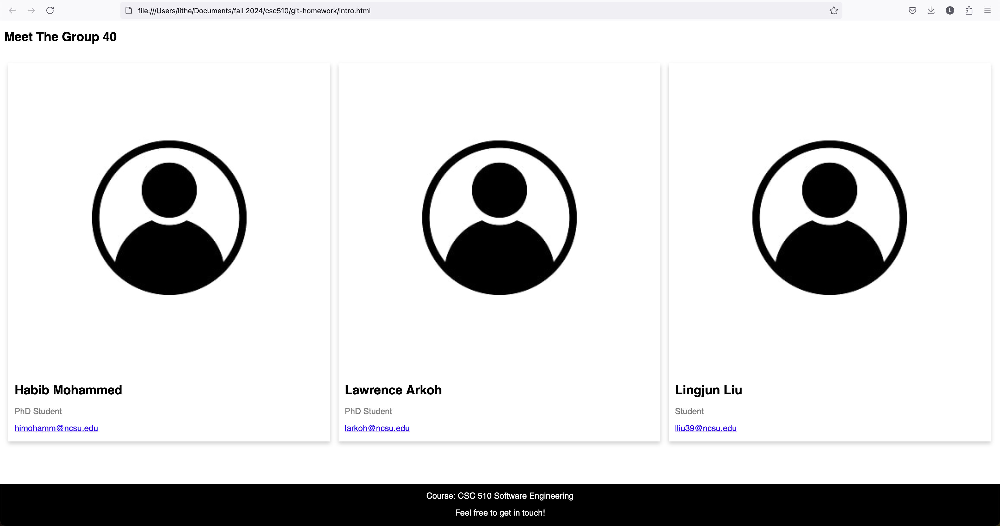

# Homework 5 - Git

## Overview
This repository is a part of the Git homework assignment designed to practice various Git functionalities, including initializing a repository, branching, merging, resolving conflicts, stashing changes, and cleaning up. Each step is recorded in the commit history to demonstrate the completion of tasks.

## Page Screenshot
